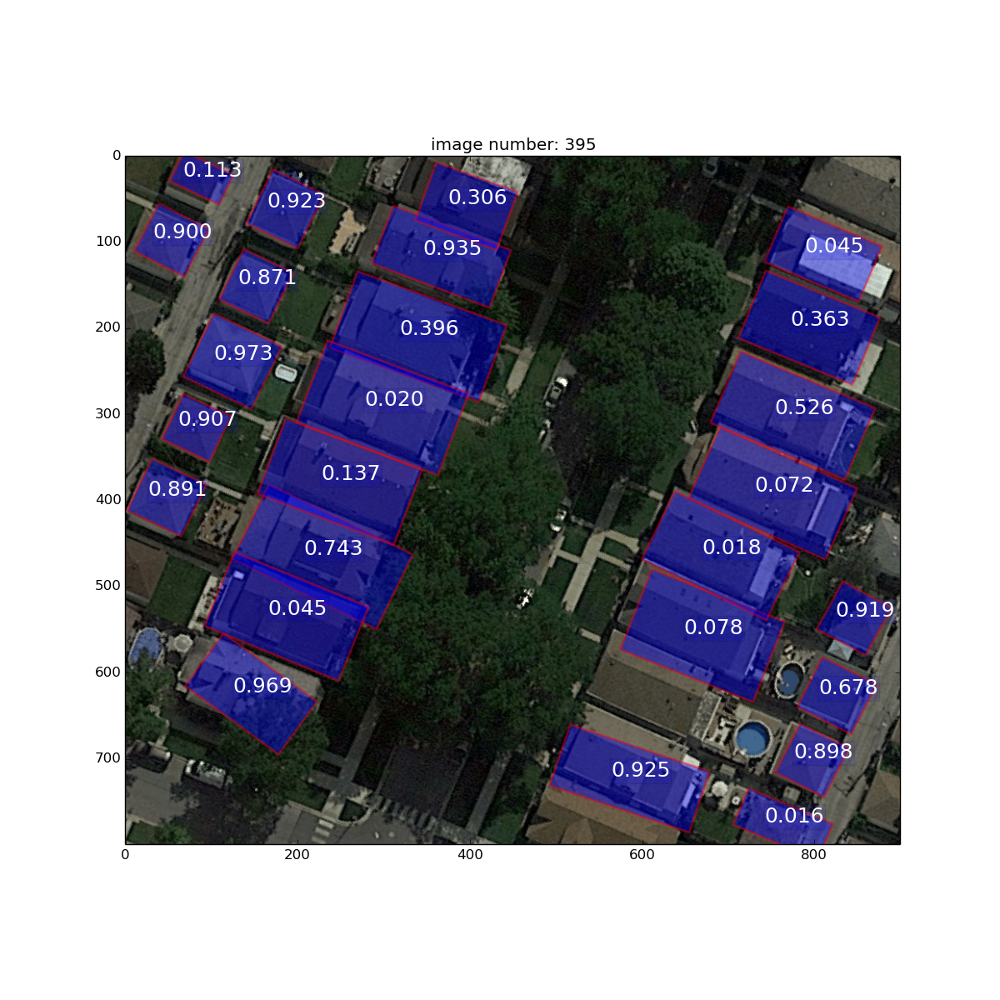
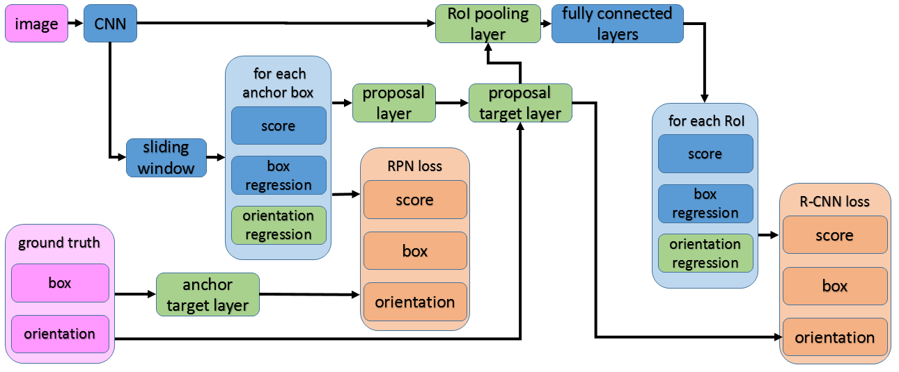
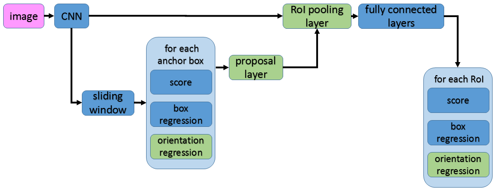

# FRCNN_git

Faster R-CNN is an object detection algorithm capable to detect objects and regress rectangular axis aligned bounding boxes. We've adapted the original Faster R-CNN source code (see [Faster R-CNN tensorflow](https://github.com/smallcorgi/Faster-RCNN_TF)), such that rectangular boxes of any rotation can be predicted. 
 
This code is thought as a starting point for work with Faster R-CNN on rotated boxes and we hope you may benefit from this implementation. Nevertheless we can't guarantee its correctness nor provide support.
 
* The network was tested on aerial images, where we detect buildings. So this version does currently not support more than one object class.

* We do not use flipped images, as data is augmented otherwise.

* We've implemented a GPU version of the new RoI pooling operation for rotated rectangles, but not CPU. RoI pooling could be optimized in terms of efficiency.

* We ignore RoIs which cross image boundaries (could be handled in a better way)

* All objects within one of our training images are rotated around the same angle. We assume that everything works fine even if this is not the case, but did not verify it.


### Requirements for Software and Hardware

The requirements are the same as for the original Faster R-CNN Tensorflow implementation (see [Faster R-CNN tensorflow](https://github.com/smallcorgi/Faster-RCNN_TF)). 


### Installation 

1. Clone the Faster R-CNN repository
  ```Shell
  # Clone the git repository
  git clone --recursive https://github.com/runa91/FRCNN_git.git
  ```

2. Build Cython modules
    ```Shell
    cd $FRCNN_ROOT/lib
    make
    ```

3. In case you'd like to train a model, download a pretrained VGG model here:
[Pretrained VGG](https://polybox.ethz.ch/index.php/s/oitt4w7HRWNxDmY)
store it as follows: 
$FRCNN_ROOT/data/pretrained_model/VGG_imagenet.npy

 
4. A model trained on buildings can be found at the same location:
[Pretrained VGG](https://polybox.ethz.ch/index.php/s/oitt4w7HRWNxDmY)
store it as follows:
$FRCNN_ROOT/output/faster_rcnn_end2end_sI/building_train/ VGGnet_fast_rcnn_iter_60000.ckpt


### Demo

1. I've included a few test images, you are now able to run a demonstration:
	
    ```Shell
    cd $FRCN_ROOT/tools
    python2.7 building_evaluation_git.py --model "$FRCNN_ROOT/output/faster_rcnn_end2end_sI/building_train/VGGnet_fast_rcnn_iter_60000.ckpt" --data "$FRCNN_ROOT/data/building_data/"
	```

### Training

1. Create your own data set and add a new class similar to my 'building' class to the folder $FRCNN_ROOT/lib/datasets/.
You may have a look at $FRCNN_ROOT/changes_wrt_orig_frcnn.odt for more information.

2. Train a model:

    ```Shell
    cd $FRCNN_ROOT
    ./experiments/scripts/faster_rcnn_end2end_new.sh 0 VGG16 building
    ```

### Network Structure 
1. Training network


2. Test network


### References

[Faster R-CNN: Towards Real-Time Object Detection with Region Proposal Networks](https://papers.nips.cc/paper/5638-faster-r-cnn-towards-real-time-object-detection-with-region-proposal-networks.pdf)

[Faster R-CNN tensorflow](https://github.com/smallcorgi/Faster-RCNN_TF)


